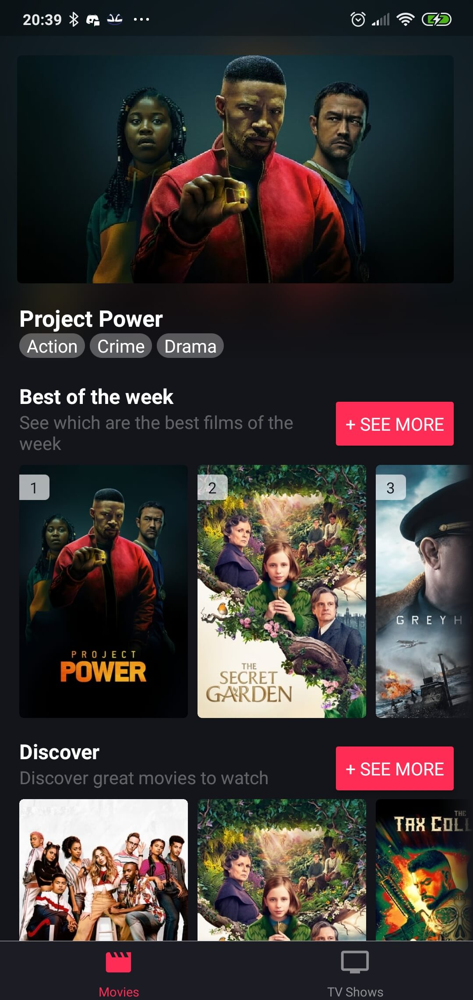
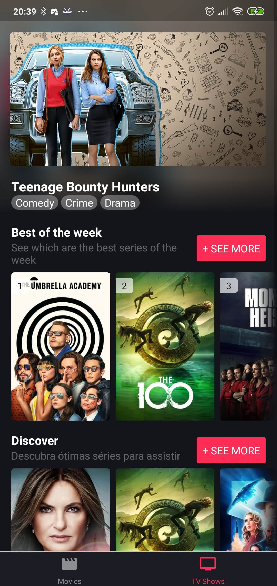
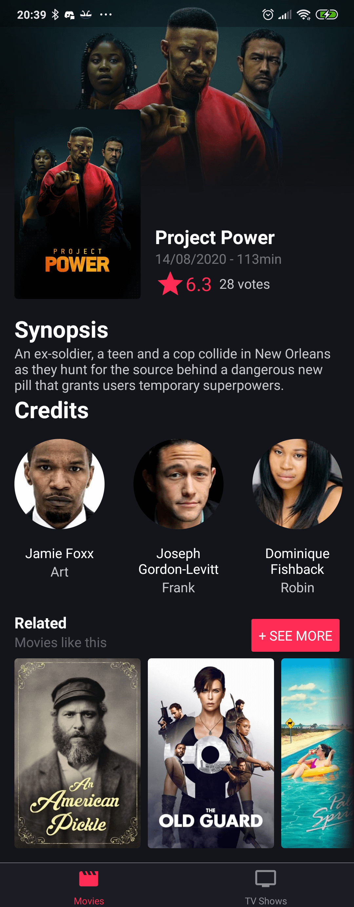
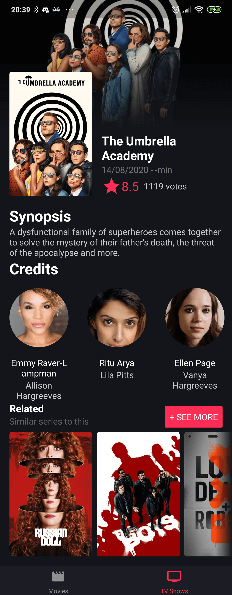
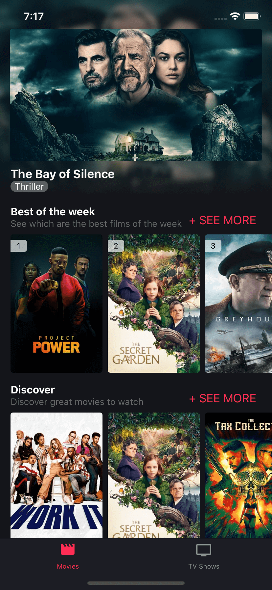
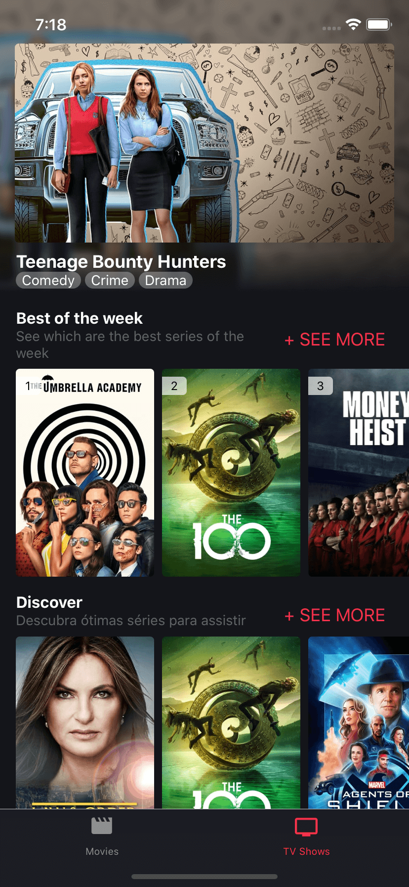
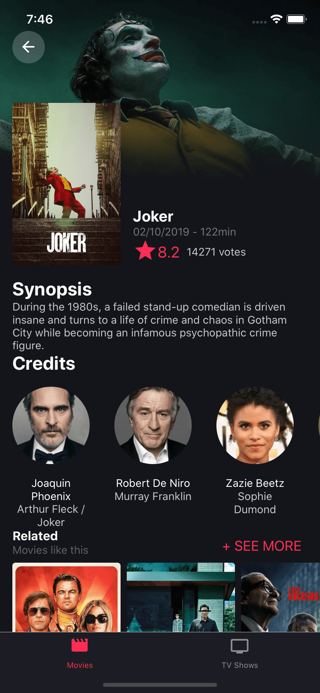
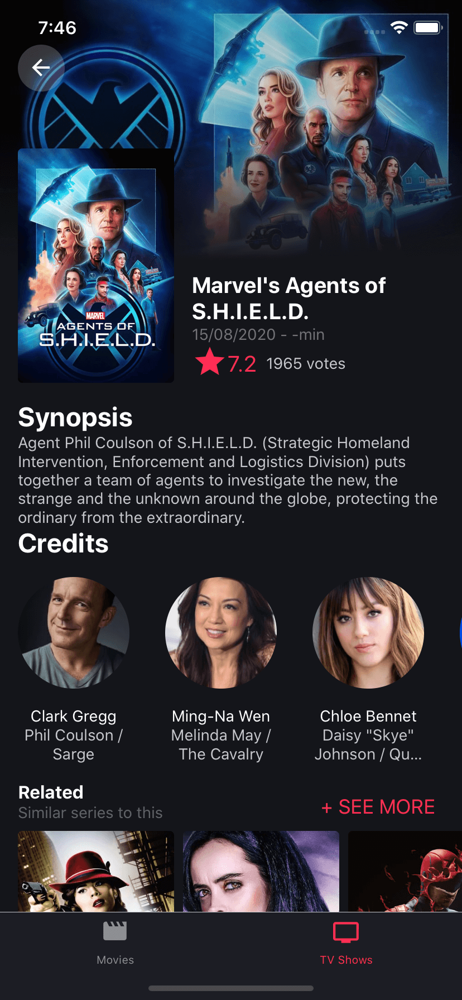

  
  <h3>TMDB</h3>
  <h4>An unofficial <a href="https://www.themoviedb.org/">TMDB</a> app</h4>

-----

### Description

This is an unofficial client app to list some information from the amazing website [The Movie Database](https://www.themoviedb.org/), the motivation to this became
when I discovered the amazing API that they have for free so I decided to build something to use their API. The main features for the app is already developed, but some of
the features that I have in mind will be developed soon.

### Android

Movies tab                |  TV Shows tab
:-------------------------:|:-------------------------:
  |  

Movie details page                |  TV Shows details page
:-------------------------:|:-------------------------:
  |  

### iOS
Movies tab                |  TV Shows tab
:-------------------------:|:-------------------------:
  |  

Movie details page                |  TV Shows details page
:-------------------------:|:-------------------------:
  |  

### Feature check-list
- [X] Display top movies of the day
- [X] Display the best movies of the week
- [X] Display a discover section for movies
- [X] Display top rated movies
- [X] See details of a movie
- [X] Show related movies of a movie
- [X] Display top TV Shows of the day
- [X] Display the best TV Shows of the week
- [X] Display a discover section for TV Shows
- [X] Display top rated TV Shows
- [X] See details of a TV Show
- [X] Show related TV Shows of a TV Show
- [ ] List all itens from each sections on movie/tv show tab
- [ ] Create a search page to find movies and TV Shows
- [ ] Internationalize the app

### Download
You can also try it on your own Android device ~sadly not on iOS yet~

To download the app, check the [releases page](https://github.com/WillianRod/tmdb-app/releases)
